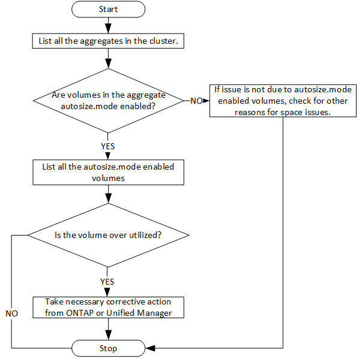

= Bestimmen von Platzproblemen in Aggregaten
:allow-uri-read: 
:icons: font
:imagesdir: ../media/

[role="lead"]
Mit den Datacenter-APIs in Active IQ Unified Manager können Sie die Verfügbarkeit und Auslastung von Speicherplatz in Ihren Volumes überwachen. Sie können Platzprobleme in Ihrem Volume ermitteln und überlastete oder nicht ausgelastete Storage-Ressourcen identifizieren.

Die Datacenter-APIs für Aggregate rufen die relevanten Informationen über verfügbaren und belegten Speicherplatz sowie Einstellungen zur Speicherplatzersparnis ab. Sie können die abgerufenen Informationen auch anhand bestimmter Attribute filtern.

Eine Methode zur Bestimmung eines Speicherplatzmangels in Ihren Aggregaten ist es, festzustellen, ob in Ihrer Umgebung Volumes mit aktiviertem Autosize-Modus vorhanden sind. Anschließend sollten Sie ermitteln, welche Volumes zu viel genutzt werden, und Sie können Korrekturmaßnahmen vornehmen.

Das folgende Flussdiagramm zeigt den Prozess zum Abrufen von Informationen zu Volumes mit aktiviertem Autosize-Modus:

Es wird vorausgesetzt, dass die Cluster bereits im ONTAP erstellt und zu Unified Manager hinzugefügt wurden.

. Beziehen Sie den Cluster-Schlüssel, es sei denn, Sie kennen den Wert:
+
[cols="3*"]
|===
| Kategorie | HTTP-Verb | Pfad 

 a| 
Rechenzentrum
 a| 
GET
 a| 
`/datacenter/cluster/clusters`

|===
. Fragen Sie mit dem Cluster Key als Filterparameter die Aggregate auf diesem Cluster ab.
+
[cols="3*"]
|===
| Kategorie | HTTP-Verb | Pfad 

 a| 
Rechenzentrum
 a| 
GET
 a| 
`/datacenter/storage/aggregates`

|===
. Analysieren Sie als Antwort den Speicherplatznutzung der Aggregate und bestimmen Sie, welche Aggregate Platzprobleme aufweisen. Beziehen Sie für jedes Aggregat mit einem Platzproblem den Aggregatschlüssel aus der gleichen JSON-Ausgabe.
. Filtern Sie mit jedem Aggregat-Schlüssel alle Volumes, die den Wert für den Parameter autosize.Mode haben, als `grow.`
+
[cols="3*"]
|===
| Kategorie | HTTP-Verb | Pfad 

 a| 
Rechenzentrum
 a| 
GET
 a| 
`/datacenter/storage/volumes`

|===
. Analyse der zu stark ausgelasteten Volumes
. Führen Sie alle erforderlichen Korrekturmaßnahmen durch, z. B. das Verschieben des Volumes über Aggregate, um die Platzprobleme im Volume zu beheben. Sie können diese Aktionen über die ONTAP- oder die Unified Manager-Weboberfläche ausführen.

