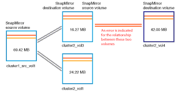

= Behebung von lag-Problemen
:allow-uri-read: 
:icons: font
:imagesdir: ../media/

[role="lead"]
Dieser Workflow bietet ein Beispiel dafür, wie Sie ein lag-Problem lösen können. In diesem Szenario greifen Sie als Administrator oder Operator auf die Seite Unified ManagerDashboard zu, um zu sehen, ob Probleme mit Ihren Schutzbeziehungen auftreten und, falls sie vorhanden sind, Lösungen zu finden.

*Was Sie brauchen*

Sie müssen über die Rolle „Anwendungsadministrator“ oder „Speicheradministrator“ verfügen.

Auf der Dashboard-Seite sehen Sie sich den Bereich „ungelöste Vorfälle und Risiken“ an und Sie sehen einen SnapMirror lag-Fehler im Teilfenster „Sicherung“ unter „Sicherungsrisiken“.

.Schritte
. Suchen Sie im Fensterbereich *Protection* auf der Seite *Dashboard* den Fehler bezüglich SnapMirror Beziehung lag und klicken Sie darauf.
+
Es wird die Seite Ereignisdetails für das Ereignis lag-Fehler angezeigt.

. Auf der Seite *Event* Details können Sie eine oder mehrere der folgenden Aufgaben ausführen:
+
** Prüfen Sie die Fehlermeldung im Feld Ursache im Übersichtsbereich, um festzustellen, ob Korrekturmaßnahmen vorgeschlagen werden.
** Klicken Sie im Feld Quelle des Übersichtsbereichs auf den Objektnamen, in diesem Fall ein Volume, um Details zum Volume anzuzeigen.
** Suchen Sie nach Notizen, die zu diesem Event hinzugefügt wurden.
** Fügen Sie dem Ereignis eine Notiz hinzu.
** Weisen Sie das Ereignis einem bestimmten Benutzer zu.
** Bestätigen oder beheben Sie das Ereignis.

. In diesem Szenario klicken Sie im Feld Quelle des Bereichs *Zusammenfassung* auf den Objektnamen (in diesem Fall ein Volume), um Details zum Volume zu erhalten.
+
Die Registerkarte Schutz der Seite Volume / Health Details wird angezeigt.

. Auf der Registerkarte *Schutz* sehen Sie sich das Topologiediagramm an.
+
Die Tatsache, dass das Volume mit dem lag-Fehler das letzte Volume einer SnapMirror Kaskadierung mit drei Volumes ist, ist zu beachten. Das ausgewählte Volume wird in Dunkelgrau dargestellt, und eine doppelte orangefarbene Linie des Quell-Volume weist auf einen SnapMirror Beziehungsfehler hin.

+

. Klicken Sie auf jedes der Volumes in der SnapMirror-Kaskadierung.
+
Bei der Auswahl der einzelnen Volumes sind die Schutzinformationen in der Zusammenfassung, Topologie, Verlauf, Ereignisse, Verwandte Geräte, Die Bereiche „Verwandte Warnungen“ ändern sich, um die für das ausgewählte Volume relevanten Details anzuzeigen.

. Sie sehen den Bereich *Zusammenfassung* und positionieren den Cursor über dem Informationssymbol im Feld *Zeitplan aktualisieren* für jedes Volumen.
+
In diesem Szenario beachten Sie, dass die SnapMirror-Richtlinie DPStandard ist und dass die SnapMirror-Zeitpläne stündlich innerhalb von fünf Minuten nach der Stunde aktualisiert werden. Sie wissen, dass alle Volumes in der Beziehung versuchen, einen SnapMirror Transfer gleichzeitig abzuschließen.

. Um das lag-Problem zu beheben, ändern Sie die Zeitpläne für zwei der kaskadierten Volumes, sodass jedes Ziel nach Abschluss des Transfers einen SnapMirror Transfer beginnt.

