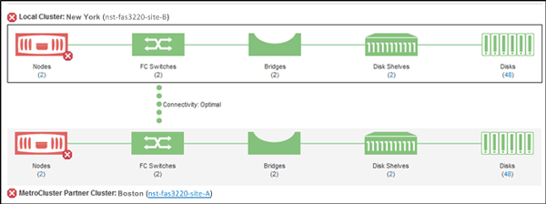

= Überprüfen des Systemzustands von Clustern in einer MetroCluster-Konfiguration
:allow-uri-read: 
:icons: font
:imagesdir: ../media/

[role="lead"]
Mit Unified Manager können Sie den Betriebszustand der Cluster und ihrer Komponenten in einer MetroCluster-Konfiguration überprüfen. Wenn die Cluster an einem von Unified Manager erkannten Performance-Ereignis beteiligt waren, kann der Integritätsstatus Ihnen dabei helfen festzustellen, ob ein Hardware- oder Softwareproblem zu dem Ereignis beigetragen hat.

*Was Sie brauchen*

* Sie müssen über die Rolle „Operator“, „Application Administrator“ oder „Storage Administrator“ verfügen.
* Sie müssen ein Performance-Ereignis für eine MetroCluster-Konfiguration analysiert und den Namen des betroffenen Clusters erhalten haben.
* Beide Cluster in der MetroCluster-Konfiguration müssen von derselben Instanz von Unified Manager überwacht werden.

.Schritte
. Klicken Sie im linken Navigationsbereich auf *Ereignisverwaltung*, um die Ereignisliste anzuzeigen.
. Wählen Sie im Filter-Panel alle MetroCluster-Filter unter der Kategorie *Quelltyp* aus.
. Klicken Sie neben einem MetroCluster-Ereignis auf den Namen des Clusters.
+
Die Ansicht Systemzustand: Alle Cluster wird mit detaillierten Informationen über das Ereignis angezeigt.

+
[NOTE]
====
Wenn keine MetroCluster-Ereignisse angezeigt werden, können Sie mithilfe der Suchleiste nach dem Namen des Clusters suchen, das am Performance-Ereignis beteiligt ist.

====
. Wählen Sie die Registerkarte *MetroCluster Connectivity* aus, um den Zustand der Verbindung zwischen dem ausgewählten Cluster und seinem Partner-Cluster anzuzeigen.
+

+
In diesem Beispiel werden die Namen und die Komponenten des lokalen Clusters und dessen Partner-Cluster angezeigt. Ein gelbes oder rotes Symbol bedeutet, dass für die markierte Komponente ein Systemzustandsereignis angezeigt wird. Das Verbindungssymbol stellt die Verbindung zwischen den Clustern dar. Sie können mit dem Mauszeiger auf ein Symbol zeigen, um Ereignisinformationen anzuzeigen, oder auf das Symbol klicken, um die Ereignisse anzuzeigen. Möglicherweise hat ein Systemzustandsproblem auf einem der Cluster zum Performance-Ereignis beigetragen.

+
Unified Manager überwacht die NVRAM-Komponente der Verbindung zwischen den Clustern. Wenn das FC-Switch-Symbol im lokalen Cluster oder Partner-Cluster oder das Konnektivitätssymbol rot ist, könnte ein Systemzustandsproblem möglicherweise das Performance-Ereignis verursacht haben.

. Wählen Sie die Registerkarte *MetroCluster-Replikation* aus.
+
image::../media/opm_um_mcc_replication_tab_png.gif[Registerkarte „Unified Manager MetroCluster Replication“]

+
Wenn in diesem Beispiel das NVRAM-Symbol auf dem lokalen oder Partner-Cluster gelb oder rot ist, hat möglicherweise ein Systemzustandsproblem im NVRAM das Performance-Ereignis verursacht. Wenn auf der Seite keine roten oder gelben Symbole angezeigt werden, hat möglicherweise ein Performance-Problem auf dem Partner-Cluster das Performance-Ereignis verursacht.

