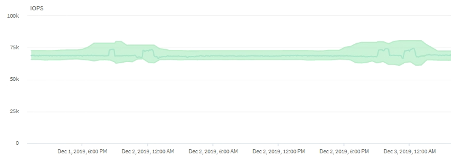

= Einfluss von Cluster-Vorgängen auf die Workload-Latenz
:allow-uri-read: 
:icons: font
:imagesdir: ../media/

[role="lead"]
Operationen (IOPS) stellen die Aktivität aller benutzerdefinierten und systemdefinierten Workloads auf einem Cluster dar. Die IOPS-Statistiken helfen Ihnen bei der Bestimmung, ob Cluster-Prozesse, z. B. Backups oder Deduplizierungsvorgänge, Auswirkungen auf die Workload-Latenz (Reaktionszeit) haben oder ein Performance-Ereignis verursacht haben oder dazu beigetragen haben.

Bei der Analyse von Performance-Ereignissen können Sie mithilfe der IOPS-Statistiken feststellen, ob ein Performance-Ereignis durch ein Problem auf dem Cluster verursacht wurde. Ermitteln Sie die spezifischen Workload-Aktivitäten, die möglicherweise zum Performance-Event beigetragen haben. Die IOPS werden in Operationen pro Sekunde (OPs/Sek.) gemessen.

Dieses Beispiel zeigt das IOPS-Diagramm. Die tatsächliche Betriebsstatistik ist eine blaue Linie, und die IOPS-Prognose für die Betriebsstatistiken ist grün.

[NOTE]
====
In manchen Fällen, in denen ein Cluster überlastet ist, wird möglicherweise von Unified Manager die Meldung angezeigt `Data collection is taking too long on Cluster _cluster_name_`. Das bedeutet, dass für die Analyse von Unified Manager nicht genügend Statistiken erfasst wurden. Sie müssen die Ressourcen, die das Cluster verwendet, verringern, um Statistiken erfassen zu können.

====