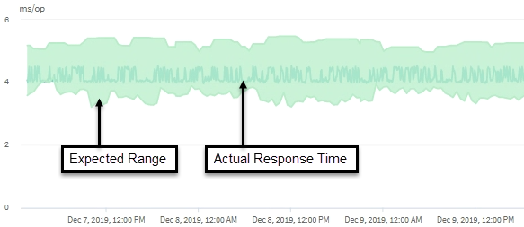

= Unified Manager verwendet Workload-Latenz zur Identifizierung von Performance-Problemen
:allow-uri-read: 
:icons: font
:imagesdir: ../media/

[role="lead"]
Die Workload-Latenz (Reaktionszeit) ist die Zeit, die ein Volume auf einem Cluster benötigt, um auf I/O-Anforderungen von Client-Applikationen zu reagieren. Unified Manager verwendet die Latenz, um Performance-Ereignisse zu erkennen und zu benachrichtigen.

Eine hohe Latenz bedeutet, dass Anfragen von Applikationen auf Volumes eines Clusters länger dauern als üblich. Die Ursache für die hohe Latenz könnte sich auf dem Cluster selbst befinden, aufgrund von Konflikten bei einer oder mehreren Cluster-Komponenten. Hohe Latenzzeiten könnten auch auf Probleme außerhalb des Clusters zurückzuführen sein, beispielsweise Netzwerkengpässe, Probleme mit dem Client, der die Applikationen hostet, oder Probleme mit den Applikationen selbst.

[NOTE]
====
Unified Manager überwacht nur die Workload-Aktivität auf dem Cluster. Er überwacht nicht die Applikationen, Clients oder Pfade zwischen den Applikationen und dem Cluster.

====
Operationen im Cluster, z. B. die Erstellung von Backups oder die Durchführung von Deduplizierung, die die Anforderungen von Clusterkomponenten erhöhen, die für andere Workloads gemeinsam genutzt werden, können ebenfalls zu einer hohen Latenz beitragen. Wenn die tatsächliche Latenz den dynamischen Performance-Schwellenwert des erwarteten Bereichs (Latenzprognose) überschreitet, analysiert Unified Manager das Ereignis, um zu ermitteln, ob es sich um ein Performance-Ereignis handelt, das möglicherweise behoben werden muss. Die Latenz wird in Millisekunden pro Vorgang (ms/op) gemessen.

Auf dem Diagramm „Latenz insgesamt“ auf der Seite „Workload-Analyse“ können Sie eine Analyse der Latenzstatistiken anzeigen, um zu ermitteln, wie die Aktivitäten einzelner Prozesse, wie z. B. Lese- und Schreibanfragen, mit den allgemeinen Latenzstatistiken vergleichen. Der Vergleich hilft Ihnen dabei zu ermitteln, welche Vorgänge die höchste Aktivität haben oder ob bestimmte Vorgänge anormale Aktivitäten haben, die sich auf die Latenz eines Volumes auswirken. Bei der Analyse von Performance-Ereignissen können Sie mithilfe der Latenzstatistiken feststellen, ob ein Ereignis durch ein Problem auf dem Cluster verursacht wurde. Sie können auch die spezifischen Workload-Aktivitäten oder Cluster-Komponenten ermitteln, die am Ereignis beteiligt sind.

Dieses Beispiel zeigt das Latenzdiagramm . Die Aktivität der tatsächlichen Reaktionszeit (Latenz) ist blau und die Latenzprognose (erwarteter Bereich) ist grün.

[NOTE]
====
In der blauen Zeile kann es zu Lücken kommen, wenn Unified Manager keine Daten erfassen konnte. Dies kann eintreten, da das Cluster oder Volume nicht erreichbar war, Unified Manager während dieser Zeit ausgeschaltet wurde oder die Sammlung länger als den 5-Minuten-Erfassungszeitraum nahm.

====