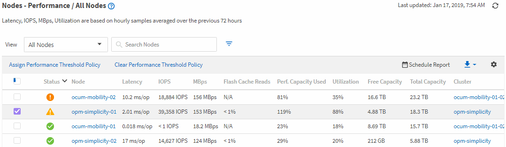

= Überwachung der Performance mithilfe der Seiten „Performance Inventory“ (Performance-Bestandsaufnahme
:allow-uri-read: 
:icons: font
:imagesdir: ../media/

[role="lead"]
Auf den Objektbestands-Performance-Seiten werden Performance-Informationen, Performance-Ereignisse und Objektzustand für alle Objekte innerhalb einer Objekttyp-Kategorie angezeigt. Dadurch erhalten Sie einen schnellen Überblick über den Performance-Status jedes Objekts in einem Cluster, beispielsweise für alle Nodes oder alle Volumes.

Die Seiten für die Objektbestandsleistung bieten einen allgemeinen Überblick über den Objektstatus, sodass Sie die Gesamtleistung aller Objekte bewerten und Objektleistungsdaten vergleichen können. Sie können den Inhalt der Objektbestandsseiten durch Suchen, Sortieren und Filtern verfeinern. Dies ist insbesondere beim Monitoring und Management der Objekt-Performance von Vorteil, da Objekte mit Performance-Problemen schnell lokalisiert und der Fehlerbehebungsprozess gestartet werden kann.

Standardmäßig werden Objekte auf den Seiten des Performance-Inventars nach Wichtigkeit der Objektleistung sortiert. Objekte mit neuen kritischen Performance-Ereignissen werden zuerst aufgeführt, Objekte mit Warnmeldungen werden an zweiter Stelle aufgeführt. Dies bietet eine unmittelbare visuelle Darstellung von Problemen, die behoben werden müssen. Alle Performance-Daten basieren auf einem Durchschnitt von 72 Stunden.

Sie können einfach von der Seite „Objektbestandsleistung“ zu einer Seite mit Objektdetails navigieren, indem Sie in der Spalte Objektname auf den Objektnamen klicken. Beispielsweise klicken Sie auf der Seite „Bestandsaufnahme der Performance/Alle Nodes“ in der Spalte *Nodes* auf ein Node-Objekt. Die Seite Objektdetails enthält detaillierte Informationen und Details zum ausgewählten Objekt, einschließlich eines Gegenübers aktiver Ereignisse.
