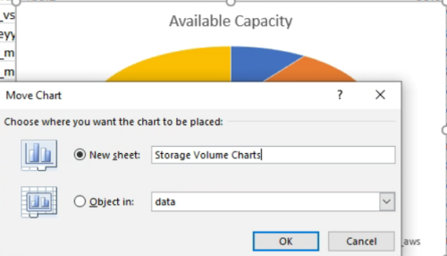

= Erstellen eines Berichts, um verfügbare Volume-Kapazitätsdiagramme anzuzeigen
:allow-uri-read: 
:icons: font
:imagesdir: ../media/

[role="lead"]
Sie können einen Bericht erstellen, um die verfügbare Volume-Kapazität in einem Excel-Diagramm zu analysieren.

*Was Sie brauchen*

* Sie müssen über die Rolle „Anwendungsadministrator“ oder „Speicheradministrator“ verfügen.

Gehen Sie wie folgt vor, um eine Health-Ansicht zu öffnen: Alle Volumes, laden Sie die Ansicht in Excel herunter, erstellen Sie ein verfügbares Kapazitätdiagramm, laden Sie die benutzerdefinierte Excel-Datei hoch und planen Sie den Abschlussbericht.

.Schritte
. Klicken Sie im linken Navigationsbereich auf *Storage* > *Volumes*.
. Wählen Sie *Berichte* > *Excel Herunterladen*.
+
image::../media/download_excel_menu.png[Excel-Menü herunterladen]

+
Je nach Browser müssen Sie möglicherweise auf *OK* klicken, um die Datei zu speichern.

. Klicken Sie bei Bedarf auf *Bearbeiten aktivieren*.
. Öffnen Sie in Excel die heruntergeladene Datei.
. Auf dem `data` Wählen Sie die Daten aus, die Sie im verwenden möchten `Volume` Und `Available Data` %-Spalten.
. Wählen Sie im Menü * Einfügen* die Option A aus `3-D piechart.`
+
Das Diagramm zeigt, welche Volumen den größten verfügbaren Platz haben. Das Diagramm wird auf dem Datenblatt angezeigt.

+
[NOTE]
====
Je nach Netzwerkkonfiguration kann die Auswahl der gesamten Spalten oder zu vielen Datenzeilen das Kreisdiagramm unlesbar machen. Dieses Beispiel verwendet das 3-D-Kreisdiagramm, aber Sie können jeden Diagrammtyp verwenden. Verwenden Sie das Diagramm, in dem die zu verwendenden Daten am besten angezeigt werden.

====
. Name des Diagrammtitels *verfügbare Kapazität*.
. Klicken Sie mit der rechten Maustaste auf das Diagramm und wählen Sie *Diagramm verschieben*.
. Wählen Sie *Neues Blatt* und benennen Sie das Blatt *Speichervolumendiagramme*.
+
[NOTE]
====
Stellen Sie sicher, dass das neue Blatt nach den Angaben und Datenblättern angezeigt wird.

====
+

. Mit den Menüs *Design* und *Format*, die verfügbar sind, wenn das Diagramm ausgewählt ist, können Sie das Aussehen des Diagramms anpassen.
. Wenn Sie zufrieden sind, speichern Sie die Datei mit Ihren Änderungen.
. Wählen Sie in Unified Manager die Option *Berichte* > *Excel hochladen* aus.
+
[NOTE]
====
Stellen Sie sicher, dass Sie sich in der gleichen Ansicht befinden, in der Sie die Excel-Datei heruntergeladen haben.

====
. Wählen Sie die Excel-Datei aus, die Sie geändert haben.
. Klicken Sie Auf *Offen*.
. Klicken Sie Auf *Absenden*.
+
Neben dem Menüpunkt *Berichte* > *Excel hochladen* wird ein Häkchen angezeigt.

+
image::../media/upload_excel.png[Laden Sie Excel hoch]

. Klicken Sie Auf *Geplante Berichte*.
. Klicken Sie auf *Zeitplan hinzufügen*, um der Seite *Berichtspläne* eine neue Zeile hinzuzufügen, damit Sie die Terminplaneigenschaften für den neuen Bericht definieren können.
. Geben Sie einen Namen für den Berichtsplan ein, und füllen Sie die anderen Berichtsfelder aus, und klicken Sie dann auf das Häkchen (image:../media/blue_check.gif[""]Am Ende der Reihe.
+
[NOTE]
====
Wählen Sie das Format *XLSX* für den Bericht aus.

====
+
Der Bericht wird sofort als Test gesendet. Danach wird der Bericht generiert und per E-Mail an die Empfänger gesendet, die unter der angegebenen Häufigkeit aufgeführt sind.

Auf Grundlage der im Bericht gezeigten Ergebnisse sollten Sie die Last auf den Volumes ausgleichen.
