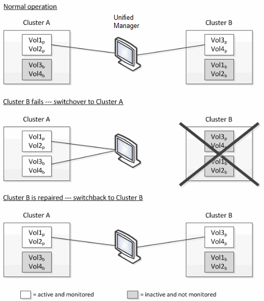

= Volume-Verhalten während des Umschalens und Zurück
:allow-uri-read: 
:icons: font
:imagesdir: ../media/

[role="lead"]
Ereignisse, die ein Switchover oder einen Switchover auslösen, bewirken, dass aktive Volumes von einem Cluster zu einem anderen Cluster in der Disaster-Recovery-Gruppe verschoben werden. Die Volumes auf dem Cluster, die aktiv waren und Clients Daten bereitstellen, werden angehalten, und die Volumes auf dem anderen Cluster sind aktiviert, und mit der Bereitstellung von Daten beginnen Sie. Unified Manager überwacht nur die Volumes, die aktiv sind und ausgeführt werden.

Da Volumes von einem Cluster zum anderen verschoben werden, wird empfohlen, beide Cluster zu überwachen. Eine einzige Instanz von Unified Manager kann beide Cluster in einer MetroCluster-Konfiguration überwachen. Manchmal erfordert die Entfernung zwischen den beiden Standorten jedoch zwei Unified Manager-Instanzen, um beide Cluster zu überwachen. Die folgende Abbildung zeigt eine einzelne Instanz von Unified Manager:

Die Volumes mit p in ihren Namen geben die primären Volumes an, und die Volumes mit b in ihren Namen sind durch SnapMirror erstellte gespiegelte Backup-Volumes.

Im Normalbetrieb:

* Cluster A verfügt über zwei aktive Volumes: Vol1p und Vol2p.
* Cluster B verfügt über zwei aktive Volumes: Vol3p und Vol4p.
* Cluster A hat zwei inaktive Volumes: Vol3b und Vol4b.
* Cluster B hat zwei inaktive Volumes: Vol1b und Vol2b.

Informationen zu jedem aktiven Volume (Statistiken, Ereignisse usw.) werden von Unified Manager erfasst. Die Statistiken zu Vol1p und Vol2p werden von Cluster A gesammelt, und die Statistiken von Vol3p und Vol4p werden von Cluster B gesammelt

Nach einem katastrophalen Ausfall verursacht eine Umschaltung aktiver Volumes von Cluster B zu Cluster A:

* Cluster A verfügt über vier aktive Volumes: Vol1p, Vol2p, Vol3b und Vol4b.
* Cluster B hat vier inaktive Volumes: Vol3p, Vol4p, Vol1b und Vol2b.

Wie im normalen Betrieb werden Informationen zu den aktiven Volumes von Unified Manager erfasst. Aber in diesem Fall werden die Statistiken zu Vol1p und Vol2p von Cluster A gesammelt, und die Statistiken Vol3b und Vol4b werden auch von Cluster A gesammelt

Beachten Sie, dass Vol3p und Vol3b nicht die gleichen Volumes sind, weil sie auf verschiedenen Clustern sind. Die Informationen im Unified Manager für Vol3p sind nicht identisch mit Vol3b:

* Während der Umstellung auf Cluster A sind Vol3p-Statistiken und -Ereignisse nicht sichtbar.
* Bei der ersten Umschaltung sieht Vol3b wie ein neues Volume ohne historische Informationen aus.

Wenn Cluster B repariert wird und ein Switchback durchgeführt wird, ist Vol3p wieder für Cluster B aktiv. Dies enthält die historischen Statistiken und eine Lücke zwischen den Statistiken für den Zeitraum während der Umschaltung. Vol3b kann von Cluster A nicht angezeigt werden, bis eine weitere Umschaltung erfolgt:

image::../media/opm_mcc_volumes.gif[opm mcc-Volumes]

[NOTE]
====
* MetroCluster Volumes, die inaktiv sind, z. B. Vol3b auf Cluster A nach dem Wechsel zurück, werden mit der Meldung „`Dieses Volume wurde gelöscht`“ identifiziert. Das Volume wird nicht tatsächlich gelöscht, es wird jedoch derzeit nicht von Unified Manager überwacht, da es sich nicht um das aktive Volume handelt.
* Wenn ein einziger Unified Manager beide Cluster in einer MetroCluster Konfiguration überwacht, liefert die Volume-Suche Informationen, unabhängig davon, welches Volume zu diesem Zeitpunkt aktiv ist. Eine Suche nach „VOL3“ gibt beispielsweise Statistiken und Ereignisse für Vol3b auf Cluster A zurück, wenn eine Umschaltung erfolgt ist und VOL3 für Cluster A aktiv geworden ist

====