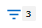

= Inhalt der Bestandsseite wird gefiltert
:allow-uri-read: 
:icons: font
:imagesdir: ../media/

[role="lead"]
Sie können die Daten auf den Inventarseiten in Unified Manager filtern, um Daten anhand spezifischer Kriterien schnell zu finden. Mithilfe der Filterung können Sie den Inhalt der Seiten von Unified Manager einschränken, um nur die für Sie jeweils interessierten Ergebnisse anzuzeigen. Dies bietet eine sehr effiziente Methode, um nur die Daten anzuzeigen, in denen Sie interessiert sind.

Verwenden Sie *Filterung*, um die Rasteransicht entsprechend Ihren Einstellungen anzupassen. Die verfügbaren Filteroptionen basieren auf dem Objekttyp, der im Raster angezeigt wird. Wenn aktuell Filter angewendet werden, wird rechts neben der Schaltfläche Filter die Anzahl der angewendeten Filter angezeigt.

Es werden drei Filterparameter unterstützt.

|===
| Parameter | Validierung 

 a| 
Zeichenfolge (Text)
 a| 
Die Operatoren sind *enthält*, *beginnt mit*, *endet mit* und *enthält nicht*.

 a| 
Nummer
 a| 
Die Betreiber sind *größer als*, *kleiner als*, *im letzten* und *zwischen*.

 a| 
Enum (Text)
 a| 
Die Betreiber sind *ist* und *ist nicht*.

|===
Die Felder Spalte, Operator und Wert sind für jeden Filter erforderlich. Die verfügbaren Filter spiegeln die filterbaren Spalten auf der aktuellen Seite wider. Es können maximal vier Filter angewendet werden. Gefilterte Ergebnisse basieren auf kombinierten Filterparametern. Gefilterte Ergebnisse gelten für alle Seiten in Ihrer gefilterten Suche und nicht nur für die aktuell angezeigte Seite.

Sie können Filter über das Filterfenster hinzufügen.

. Klicken Sie oben auf der Seite auf die Schaltfläche *Filter*. Das Filterfenster wird angezeigt.
. Klicken Sie auf die linke Dropdown-Liste und wählen Sie ein Objekt aus, z. B. _Cluster_ oder einen Performance-Zähler.
. Klicken Sie auf die mittlere Dropdown-Liste, und wählen Sie den gewünschten Operator aus.
. Wählen Sie in der letzten Liste einen Wert aus oder geben Sie einen Wert ein, um den Filter für dieses Objekt abzuschließen.
. Um einen anderen Filter hinzuzufügen, klicken Sie auf *+Filter hinzufügen*. Es wird ein zusätzliches Filterfeld angezeigt. Führen Sie diesen Filter mithilfe des in den vorherigen Schritten beschriebenen Verfahrens aus. Beachten Sie, dass beim Hinzufügen Ihres vierten Filters die Schaltfläche *+Filter hinzufügen* nicht mehr angezeigt wird.
. Klicken Sie Auf *Filter Anwenden*. Die Filteroptionen werden auf das Raster angewendet und die Anzahl der Filter wird rechts neben der Schaltfläche Filter angezeigt.
. Verwenden Sie den Filterbereich, um einzelne Filter zu entfernen, indem Sie auf das Papierkorb-Symbol rechts neben dem zu entfernenden Filter klicken.
. Um alle Filter zu entfernen, klicken Sie unten im Filterfenster auf *Zurücksetzen*.

== Beispiel für die Filterung

Die Abbildung zeigt das Filterfeld mit drei Filtern. Die Schaltfläche *+Filter hinzufügen* wird angezeigt, wenn Sie weniger als vier Filter haben.

image::../media/opm_filtering_panel_draft_3.gif[opm-Filterpanel Entwurf 3]

Nach dem Klicken auf *Filter anwenden* wird das Filterfeld geschlossen, die Filter angewendet und die Anzahl der angewendeten Filter angezeigt ().
